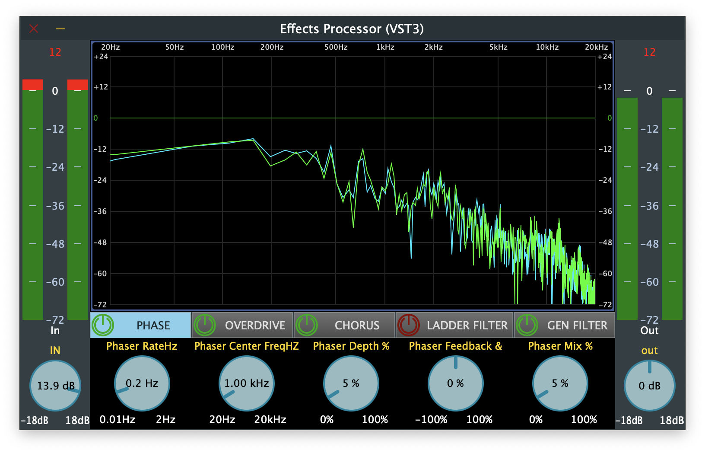
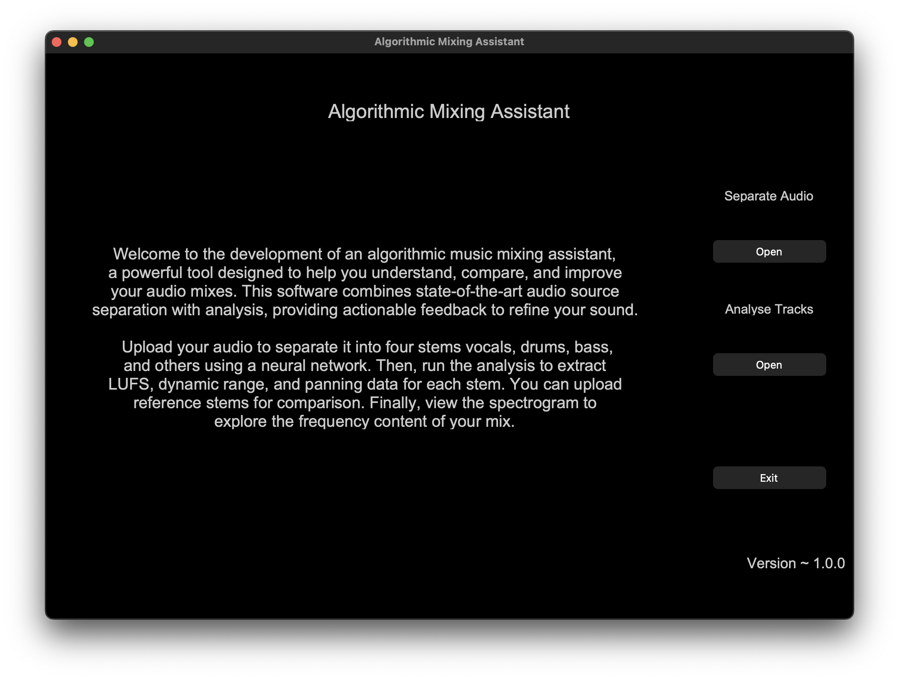
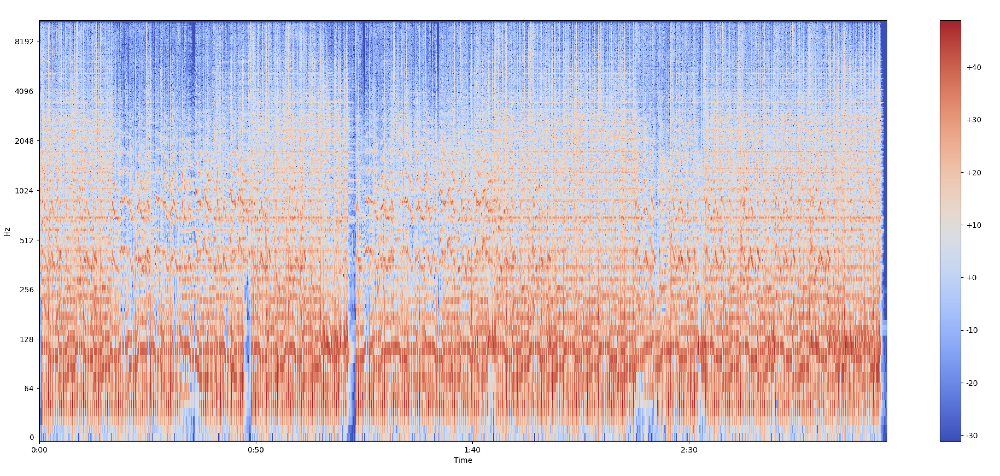
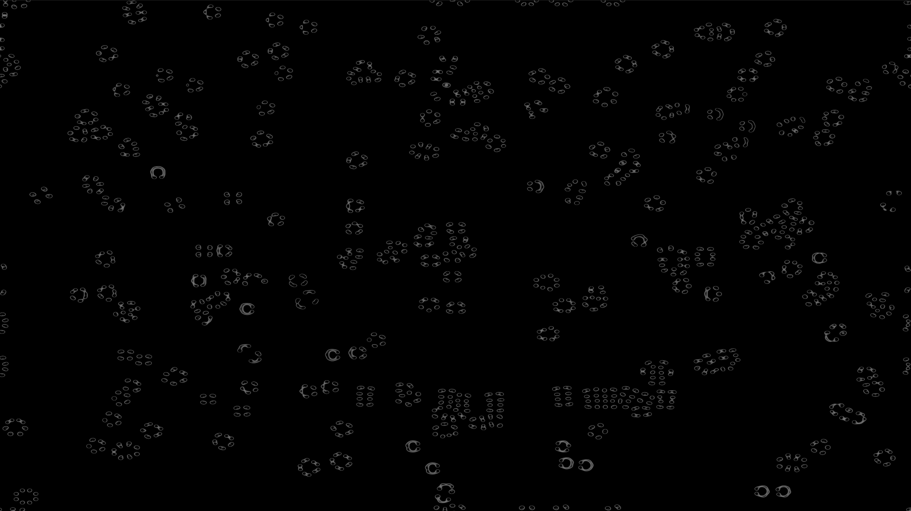

<!-- HEADER -->

<!-- # Aditya Gokhe -->

MSc in Music Technology | Generative Music | Neural Networks | Music Information Retrieval |

Python, C++, MaxMSP | PyTorch, TorchAudio, JUCE, Librosa, Matplotlib |

Hindustani Classical Music, South Indian Rhythm | Music theory, Western Classical Music, Piano, Guitar |

<!-- HEADER END -->

---

<!-- BODY -->

Namaste!🙏 My journey began with the appriciatation of music performance, dragging me toward learning the piano. With time the practice sessions became a means to record my pieces into DAW's to critically analyze — gradually sparking my curiosity into the technology, "How is able to record and playback the nuances of the playing?". Growing passion about music, audio, and technology. I build tools that make audio creation more expressive and accessible!

The software side, things that interests me are music information retrieval, deep learning and prototyping systems.
Contrary to that, acoutics/psycoacoutics, human interface devices and recording technologies still gets me to dive deeper.

I am always in for a quick chat! &nbsp;&nbsp;&nbsp; [📧 Email](adityagokhe08@gami.com) &nbsp;&nbsp;&nbsp; [👤 Linkedin](https://www.linkedin.com/in/adityagokhe08/) &nbsp;&nbsp;&nbsp; [👾 GitHub](https://github.com/Solfero0822) &nbsp;&nbsp;&nbsp;

---

## Audio Software Engineering Projects

### Effects Processor Audio Plugin Software

_Designed and developed a modular multi-effects audio plugin in C++ using the JUCE framework, delivering customizable audio processing with phaser, chorus, overdrive, and filter effects for real-time use._

Key Contributions:
• Built a flexible modular signal chain, enabling users to define and adjust their own effects routing to enhance creative workflows.
• Engineered an interactive user interface with dynamic parameter controls, allowing real-time sound shaping.
• Utilized Xcode for efficient development and debugging, ensuring seamless integration with industry-standard audio environments.
• Optimized DSP algorithms for minimal latency and stable real-time performance.

Technologies / Tools:
C++, JUCE, Digital Signal Processing (DSP), Xcode, Audio Plugin Development, UI/UX Design

### Algorithmic Mixing Assistant Software (Graduate Thesis)

_Developed standalone music mixing software in Python leveraging neural network–driven source separation, enabling producers to isolate and manipulate individual audio stems for creative and production workflows._

Key Contributions:
• Integrated the Open-Unmix (UMXL) model with PyTorch and TorchAudio, trained on a proprietary multi-stem dataset to improve separation quality.
• Utilized Librosa for feature extraction and Matplotlib for visual data representation, enhancing usability for music producers.
• Designed and implemented a clean, intuitive UI with CustomTkinter for streamlined user interaction.
• Built prototypes and performed performance analysis in Jupyter Notebook to refine algorithms and ensure optimal results.
• Managed collaborative development with GitHub for version control and workflow efficiency.
• Researched and initiated real-time processing for cross-platform deployment, including edge devices.

Technologies / Tools:
Python, PyTorch, TorchAudio, Librosa, Matplotlib, CustomTkinter, Jupyter Notebook, GitHub

---

## Interactive Multimedia Projects

### Here, Now

_Designed and exhibited an immersive installation using Max/MSP to investigate the interplay between audio and visual elements, engaging audiences through real-time interaction and spatial sound design._

Key Contributions:
• Implemented a reaction–diffusion visual system in jit.gl.pix with adjustable feed and kill rate presets for dynamic, real-time visual changes.
• Integrated HID controller support for live parameter modulation, enabling interactive participation from a wide range of users.
• Composed an original soundscape combining drones and rain textures with spatial audio techniques to create a responsive environment.
• Showcased the installation at Cybersounds, receiving positive audience feedback for its innovative fusion of technology, sound, and visuals.

Technologies / Tools:
Max/MSP, jit.gl.pix, HID Integration, Spatial Audio, Sound Design, Interactive Media

---

## Work Experience

### Audio Engineer Intern

**Manhattan Beach Recording Studio, New York, NY**

_Engineered high-quality lead and backing vocal recordings using industry-standard microphones and signal chains, ensuring clarity, depth, and tonal accuracy for professional production._

Key Contributions:
• Recorded vocals with Neumann U87 and Avalon AD VT-737sp, achieving detailed, high-resolution results.
• Configured various microphone techniques (MS pair, XY pair, spaced pair, Decca Tree) to optimize sound capture for diverse recording scenarios.
• Operated and maintained professional studio equipment, performing inspections for performance consistency and damage prevention.

Equipment Experience:
• Consoles: API 1608, DigiDesign Control/Command
• Preamps / Compressors: Avalon, Tube-Tech, Teletronix, Universal Audio
• Microphones: Neumann (U87, U67, M49, KM84i), Sony (C-37A, C-800G), AKG (C414, D112), Shure (SM57, SM58, SM81, SM7B)

### Audio Editor Intern

**SaReGaMa India Ltd., Mumbai, India**

_Produced and co-developed educational music content in Logic Pro X, leveraging advanced audio production techniques to ensure clarity, consistency, and learner engagement._

Key Contributions:
• Created audio-based learning modules that simplified complex music theory concepts and improved lesson flow.
• Applied professional production tools to deliver high-quality, polished audio tailored for educational use.
• Managed and organized audio assets on an internal server, streamlining team workflows and improving asset accessibility.

Technologies / Tools:
Logic Pro X, Audio Production, Music Theory, Asset Management, Educational Content Development

---

### More about what I like...r

These are thing on the side that keeps me calm, patient and relaxed while forcees me to be detail oriented, problem solving and present.

Since childhood, the Japanese art of paper folding — [Orgiami](./assets/ORIGAMI.md) has been the go to while striving away from screens. From as basic as the Traditional Crane to intermediate Kusudama Ball to 3-dimensional figures till Tessellation Models — evoking patience, eye for detail and embrace flaws.

As a teenager, the adrenaline rushes from video games is unparallel — being compatitive shooters with each pixel on Rainbow Six Siege, Valorant and Spectre Divide to completing stealth missions on Tom Clancy's Ghost Recon: Future Soldier, Wildlands and Breakpoint along with the motorsport games like Assetto Corsa and CarXdrift — is a long list consisting various geners of games — requested me to be present and take quick decisions to flip the situation around.

I am always open to talk about [Photography](./assets/PHOTOGRAPHY.md), Chess and Science.

<!-- BODY END -->

---

<!-- FOOTER -->̌

@ adityagokhe 2025 |

<!-- FOOTER END -->
