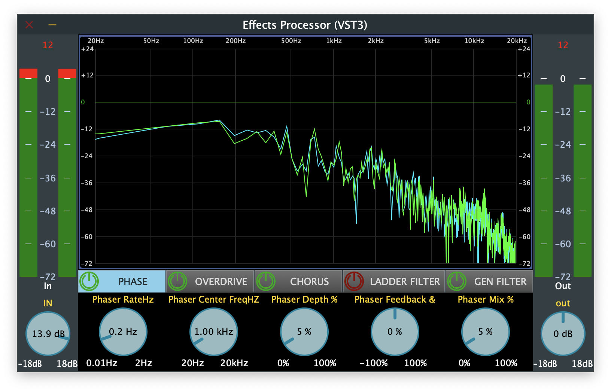
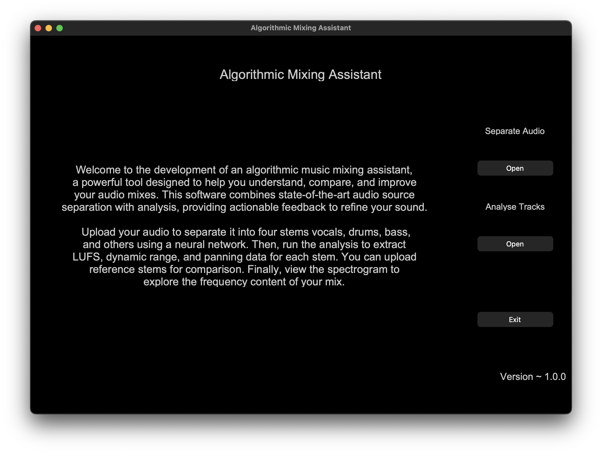
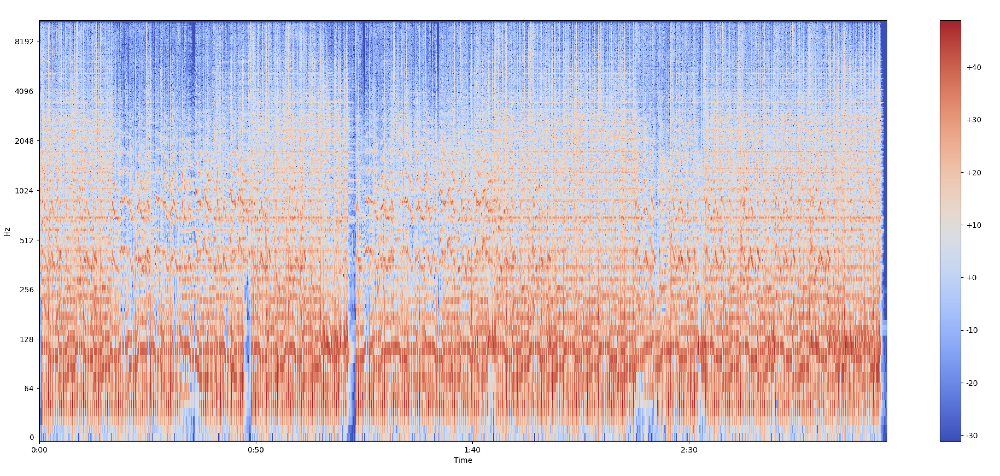
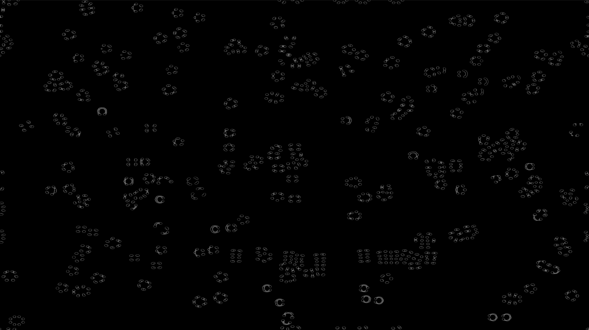

<!-- HEADER -->

<!-- # Aditya Gokhe -->

MSc in Music Technology | Python, C++, MaxMSP | PyTorch, TorchAudio, JUCE, Librosa, Matplotlib |

Generative Music | Neural Networks | Music Information Retrieval |

<!-- HEADER END -->

---

<!-- BODY -->

Hi!👋 My journey began with a passion for music and storytelling through sound. That curiosity led me to explore how technology can reshape the way we create, manipulate, and experience audio.

I focus on designing and developing audio tools and systems—ranging from intelligent mixing assistants and real-time processing frameworks to interactive sound installations and recording workflows. My work aims to make audio technology more expressive, accessible, and empowering for artists, engineers, and creative technologists.

I’m excited to contribute to the evolving future of audio by building systems that support new forms of creativity and collaboration.My journey began with a passion for music and storytelling through sound. That curiosity led me to explore how technology can reshape the way we create, manipulate, and experience audio. I focus on designing and developing audio tools and systems—ranging from intelligent mixing assistants and real-time processing frameworks to interactive sound installations and recording workflows. My work aims to make audio technology more expressive, accessible, and empowering for artists, engineers, and creative technologists. I’m excited to contribute to the evolving future of audio by building systems that support new forms of creativity and collaboration.

I am always in for a quick chat!

[📧 Email](adityagokhe08@gami.com) &nbsp;&nbsp;&nbsp;
[👤 Linkedin](https://www.linkedin.com/in/adityagokhe08/) &nbsp;&nbsp;&nbsp;
[👾 GitHub](https://github.com/Solfero0822)

---

## Audio Software Engineering Projects

### Effects Processor Audio Plugin Software

_Developed a multi-effects audio plugin in C++ using the JUCE framework, incorporating classic audio effects like phaser, chorus, overdrive, and filters, with a modular signal chain for customizable routing. The plugin features an interactive UI with real-time parameter control, allowing users to adjust depth, rate, and feedback for a personalized audio experience._

### Algorithmic Mixing Assistant Software (Graduate Thesis)

_Developed standalone software for music mixing in Python using PyTorch, integrated a neural network based audio source separation model (UMXL) by Open-Unmix, extracted key features such as LUFS, Dynamic Range and Panning with Librosa. Visualizing the audio file as spectrogram with the help of Matplotlib and designed the user interface with CustomTkinter. Currently exploring real-time processing in C++ and ONNX realtime_

---

## Interactive Multimedia Projects

### Here, Now

_Created an interactive installation in Max/MSP that merged audio and visuals, using a reaction-diffusion system to generate dynamic, customizable visuals. The experience featured spatial audio, real-time parameter manipulation via game controllers, and an ambient soundscape that complemented the evolving visuals._

---

## Work Experience

### Audio Engineer Intern

**Manhattan Beach Recording Studio, New York, NY**  
_Recorded lead and backing vocals using high-end gear including the Neumann U87 and Avalon AD VT-737sp, ensuring professional sound quality. Supported microphone setup for various stereo techniques—MS, XY, spaced pair, and Decca Tree—and maintained studio equipment for peak performance._

### Audio Editor Intern

**SaReGaMa India Ltd., Mumbai, India**  
_Edited and processed educational audio content in Logic Pro X to improve clarity and consistency, while managing audio assets to optimize production workflows. Co-developed audio-based learning modules, enhancing narration quality and contextual flow._

<!-- BODY END -->

---

<!-- FOOTER -->̌

@ adityagokhe 2025

<!-- FOOTER END -->
