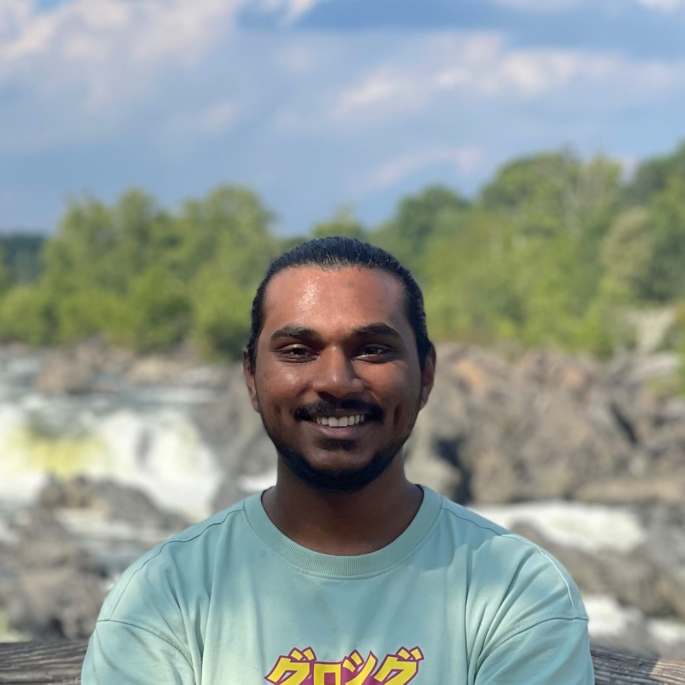

<!-- HEADER -->

<!-- # Aditya Gokhe -->

MSc in Music Technology | Python, C++, MaxMSP | PyTorch, TorchAudio, JUCE, Librosa, Matplotlib|

<!--  -->

<!-- HEADER END -->

---

<!-- BODY -->

Hi!👋 My journey began with a passion for music and storytelling through sound. That curiosity led me to explore how technology can reshape the way we create, manipulate, and experience audio.

I focus on designing and developing audio tools and systems—ranging from intelligent mixing assistants and real-time processing frameworks to interactive sound installations and recording workflows. My work aims to make audio technology more expressive, accessible, and empowering for artists, engineers, and creative technologists.

I’m excited to contribute to the evolving future of audio by building systems that support new forms of creativity and collaboration.My journey began with a passion for music and storytelling through sound. That curiosity led me to explore how technology can reshape the way we create, manipulate, and experience audio. I focus on designing and developing audio tools and systems—ranging from intelligent mixing assistants and real-time processing frameworks to interactive sound installations and recording workflows. My work aims to make audio technology more expressive, accessible, and empowering for artists, engineers, and creative technologists. I’m excited to contribute to the evolving future of audio by building systems that support new forms of creativity and collaboration.

I am always in for a quick chat!

[📧 Email](adityagokhe08@gami.com) &nbsp;&nbsp;&nbsp;
[👤 Linkedin](https://www.linkedin.com/in/adityagokhe08/) &nbsp;&nbsp;&nbsp;
[👾 GitHub](https://github.com/Solfero0822)

---

## Audio Software Engineering Projects

### Effects Processor Audio Plugin Software

_Developed a multi-effects audio plugin in C++ using the JUCE framework, incorporating classic audio effects like phaser, chorus, overdrive, and filters, with a modular signal chain for customizable routing. The plugin features an interactive UI with real-time parameter control, allowing users to adjust depth, rate, and feedback for a personalized audio experience._

### Algorithmic Mixing Assistant Software (Graduate Thesis)

_Developed standalone software for music mixing in Python using PyTorch, integrated a neural network based audio source separation model (UMXL) by Open-Unmix, extracted key features such as LUFS, Dynamic Range and Panning with Librosa. Visualizing the audio file as spectrogram with the help of Matplotlib and designed the user interface with CustomTkinter. Currently exploring real-time processing in C++ and ONNX realtime_

---

## Interactive Multimedia Projects

### Here, Now

_August 2024 – November 2024_

- Developed an interactive installation in Max/MSP to explore the relationship between audio and visuals.
- Implemented a reaction-diffusion system with custom presets for visual complexity.
- Experimented with spatial audio, using stereo panning to match visual object location.
- Integrated HID game controllers to allow users to modify parameters in real-time.
- Composed an ambient soundscape featuring drones and rain sounds to interact with the visuals.

---

## Work Experience

### Audio Engineer Intern

**Manhattan Beach Recording Studio, New York, NY**  
_June 2024 – August 2024_

- Recorded lead and backing vocals using Neumann U87 and Avalon AD Vt-737sp.
- Assisted in microphone setup including MS pair, XY pair, spaced pair, and Decca Tree.
- Performed maintenance on studio equipment, ensuring optimal performance.
- Worked with high-end equipment like Neumann U87, Sony C-37A, and AKG C414.

### Audio Editor Intern

**SaReGaMa India Ltd., Mumbai, India**  
_November 2022 – May 2023_

- Edited and processed educational audio content in Logic Pro X to enhance clarity and consistency.
- Managed and organized audio assets to streamline production workflows.
- Co-developed audio-based learning modules, refining narration and context flow.

<!-- BODY END -->

---

<!-- FOOTER -->̌

@ adityagokhe 2025

<!-- FOOTER END -->
