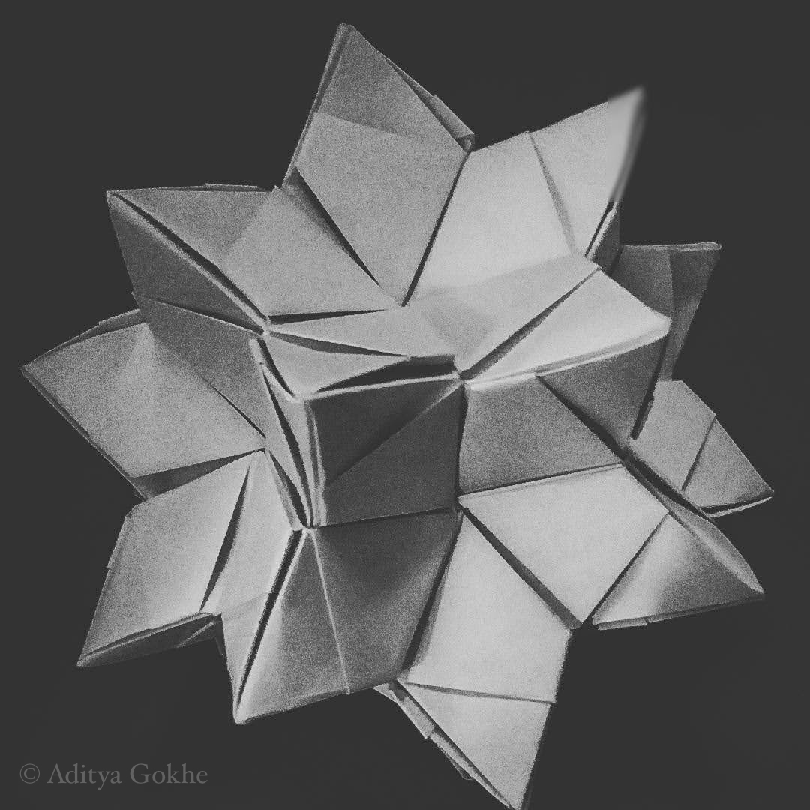
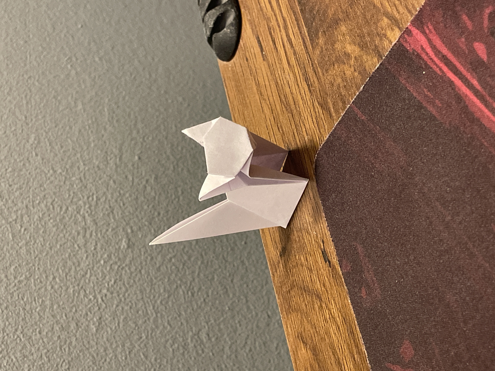
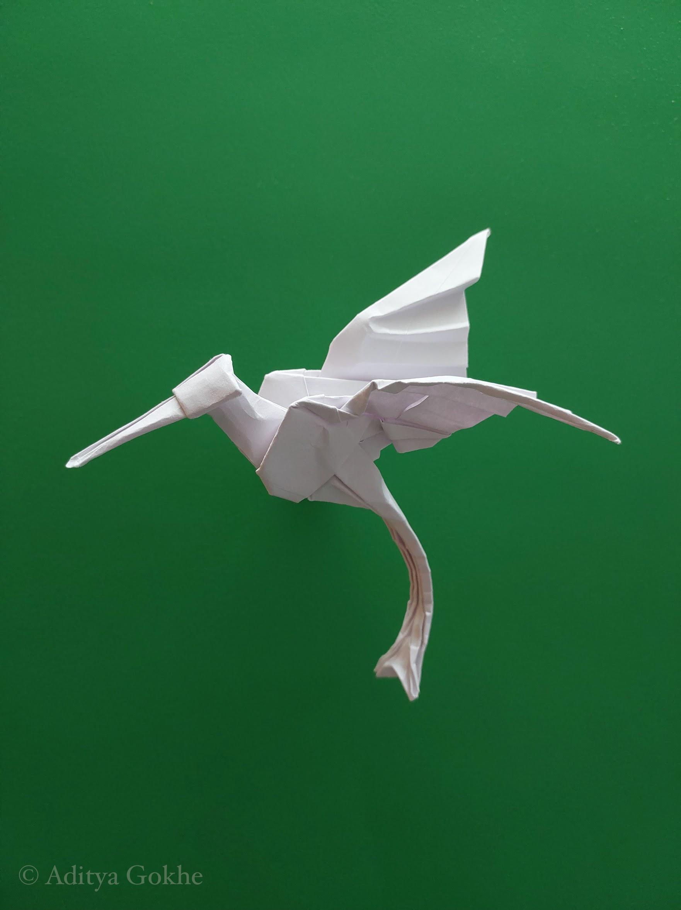

### Orizuru

The orizuru (折鶴 ori- "folded," tsuru "crane"), origami crane or paper crane, is a design that is considered to be the most classic of all Japanese origami. In Japanese culture, it is believed that its wings carry souls up to paradise, and it is a representation of the Japanese red-crowned crane, referred to as the "Honourable Lord Crane" in Japanese culture[citation needed]. It is often used as a ceremonial wrapper or restaurant table decoration. A thousand orizuru strung together is called senbazuru (千羽鶴), meaning "thousand cranes", and it is said that if someone folds a thousand cranes, they are granted one wish.

### Kusudama

The kusudama (薬玉; lit. 'medicine ball') is a paper model that is usually (although not always) created by sewing multiple identical pyramidal units together using underlying geometric principles of polyhedra to form a spherical shape. Alternately the individual components may be glued together. (e.g. the kusudama in the lower photo is not threaded together) Occasionally, a tassel is attached to the bottom for decoration.

### Modular origami

Modular origami or unit origami is a multi-stage paper folding technique in which individual modules or units are created out of sheets of paper and assembled into a flat shape or three-dimensional structure. This is usually done by inserting flaps into pockets created by the folding process, which create tension or friction and hold the model together. Some assemblies can be somewhat unstable when adhesives or string are not used.

### Hex-tessellation

A tessellation or tiling is the covering of a surface, often a plane, using one or more geometric shapes, called tiles, with no overlaps and no gaps. In mathematics, tessellation can be generalized to higher dimensions and a variety of geometries.

### More

